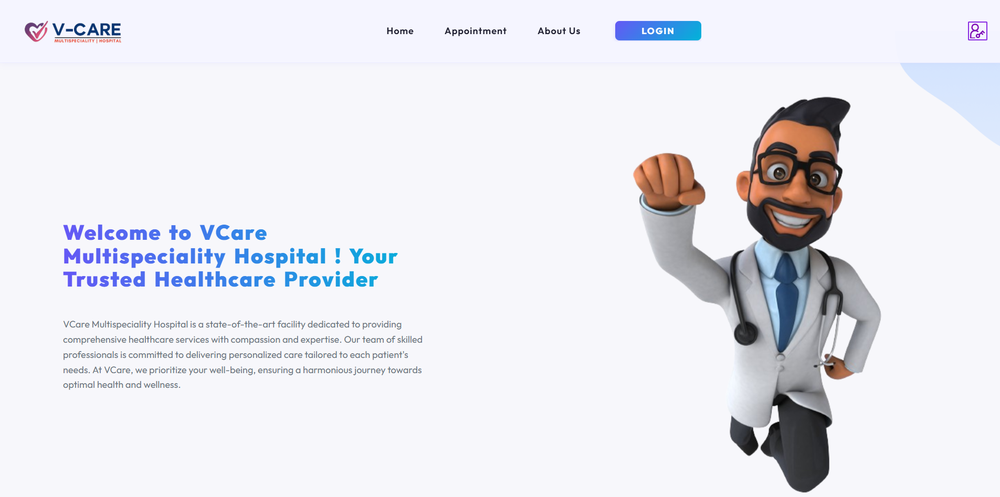
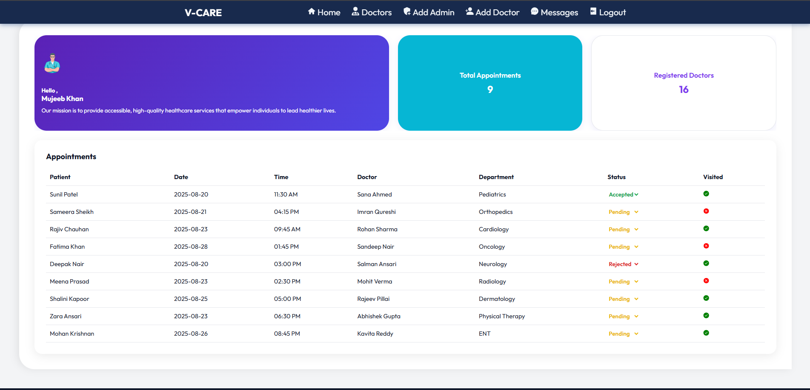

# 🏥 HospitalProject  
*A hospital management system for patients and administrators*  

🔗 **Live Demo:** [HospitalProject](https://hospital-project-mmk.netlify.app)  

---

## 🔖 Badges

---

## 📌 Project Overview
**HospitalProject** is a responsive **MERN stack application** for managing hospital operations.  

- **🎯 Patients:** Can log in, send messages, and book appointments with doctors.  
- **👨‍💼 Admin (Manager):** Can manage doctors, view appointments, and track messages.  
- Designed with a **responsive UI**, offering seamless experience across devices.  

---

## ✨ Features

### 👩‍⚕️ Patient Side (Main Website)
- User Authentication (**Login, Signup**)  
- Book appointments with available doctors  
- Send messages directly to the hospital  
- View booking history  
- Fully responsive interface  

### 🛠️ Admin Side (Dashboard)
- Secure **Admin Login**  
- Add new doctors to the hospital system  
- View and manage:
  - Patient messages  
  - Doctor appointments  
  - Doctor timings/schedules  

---

## ⚙️ Tech Stack

### Frontend
- **React.js** (Main Website + Admin Dashboard)  
- Responsive CSS  

### Backend
- **Node.js** 
-  **Express.js**  
- Authentication with:
  - JSON Web Tokens (**JWT**)  
  - **Validator**  
  - **Cookie Parser**  

### Database
- **MongoDB Atlas** (cloud-hosted NoSQL database)  

### Deployment
- **Frontend:** Deployed on **Netlify**  
- **Backend:** Hosted on **Render**  

---

## 🚀 Future Enhancements 
- Role-based system (separate Doctor panel)  
- Notifications (Email/SMS reminders for appointments)  
- Patient profile management (update personal data, medical history)  
- Dashboard analytics (graphs for appointments, doctor performance)

📸 Screenshots
Main Dashboard

 
Admin Dashboard

---

👨‍💻 Author
Mujeeb Khan
Full-Stack Developer | Web Development Enthusiast

📧 Reach me at: mujeebkhan3771@gmail.com
